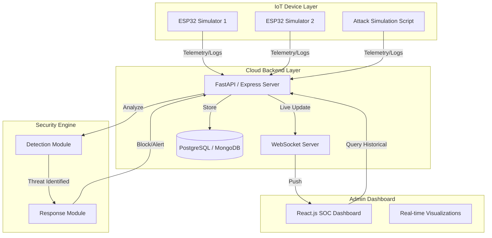

# Implementation Plan: Cloud-Based Incident Response System for IoT

This document outlines the strategic roadmap, technical architecture, and team responsibilities for developing a real-time security monitoring and incident response platform for IoT ecosystems.

## System Architecture

## Project Overview
The system aims to provide a centralized cloud-based solution for monitoring distributed IoT devices, detecting anomalies (DDoS, Brute Force, Unauthorized Access), and executing automated defensive responses.

## Technical Stack & Dependencies

### IoT Device Simulator (Python)
- `requests`: For sending HTTP telemetry to the API.
- `paho-mqtt`: (Optional) For MQTT-based communication.
- `faker`: To generate realistic device metadata.
- `schedule`: To handle periodic data transmission.

### Cloud Backend (Node.js / Express)
- `express`: Core web framework.
- `mongoose` or `pg`: Database ORM for MongoDB or PostgreSQL.
- `jsonwebtoken`: For secure device and admin authentication.
- `socket.io`: For real-time data broadcasting to the dashboard.
- `cors`: To enable cross-origin requests from the frontend.
- `dotenv`: For environment variable management.

### Security & Detection Engine (Logic within Backend)
- `express-rate-limit`: For basic DDoS/Brute-force protection at the API level.
- `validator`: For input sanitization.

### Admin Dashboard (React)
- `axios`: For API communication.
- `recharts`: For rendering live traffic and attack graphs.
- `lucide-react`: For premium security-themed icons.
- `framer-motion`: For smooth UI transitions and micro-animations.
- `socket.io-client`: To receive real-time alerts.

---

## 🛠️ Step-by-Step Implementation Guide

### Step 1: Database & Backend Setup (Person 2)
1. Initialize a Node.js project: `npm init -y`.
2. Install dependencies: `npm install express mongoose socket.io jsonwebtoken dotenv cors`.
3. Create the Database Schema:
    - **Devices**: `id`, `name`, `type`, `status` (Active, Blocked, Compromised), `lastSeen`.
    - **Incidents**: `id`, `deviceId`, `type` (Brute Force, DDoS), `severity`, `timestamp`.
4. Build the Ingestion Endpoint: `POST /api/telemetry` to receive data from devices.

### Step 2: IoT Simulator Development (Person 1)
1. Setup Python environment: `pip install requests faker schedule`.
2. Create a `Device` class that simulates heartbeat and telemetry.
3. Implement "Normal Mode": Send packets every 5 seconds with random but safe values.
4. Implement "Attack Mode": 
    - **Brute Force**: Send 20+ login attempts in 2 seconds.
    - **DDoS**: Send 100+ small packets instantly.

### Step 3: Detection & Response Logic (Person 3)
1. Create a `SecurityEngine.js` middleware in the backend.
2. **Rule 1 (Brute Force)**: Track login attempts per `deviceId` in a sliding window (e.g., Use Redis or a Map). If > 5 in 10s -> Trigger Alert.
3. **Rule 2 (Anomaly)**: Monitor packet frequency. If frequency > 10x baseline -> Mark as DDoS.
4. **Response Action**: Automatically update the device status in the DB to `Blocked` and emit a `threat-detected` event via WebSockets.

### Step 4: Premium SOC Dashboard (Person 4)
1. Initialize React app: `npx create-react-app dash --template tailwind`.
2. Design a "Security Operations Center" (SOC) interface:
    - **Stats Ribbons**: Total Devices, Active Threats, Systems Healthy.
    - **Live Logs**: A scrolling list of incoming telemetry.
    - **Alert Modal**: A high-priority popup that appears when Person 3's logic triggers.
3. Integrate Live Charts: Use `Recharts` to show a "Packets Per Second" line graph.

### Step 5: System Integration & Testing (Full Team)
1. Connect Person 1's scripts to Person 2's server.
2. Verify that Person 3's logic correctly identifies the simulated attacks.
3. Ensure Person 4's dashboard displays the alerts in real-time without refreshing.

---

## 📅 Project Timeline (8-Week Roadmap)

### Phase 1: Foundation & Architecture (Week 1)
- Finalize system architecture and data flow diagrams.
- Define Database Schema (Devices, Logs, Incidents, Alerts).
- Setup repository structure and CI/CD pipelines.

### Phase 2: Core Backend & API Development (Week 2-3)
- **Objective**: Establish the "Receiver" and "Storage" modules.
- Implement JWT-based authentication for devices and admins.
- Develop RESTful endpoints for device registration and telemetry ingestion.
- Setup WebSocket server for broadcasting live security events.

### Phase 3: IoT Simulation & Security Logic (Week 4-5)
- **Objective**: Create the "Generator" and "Brain" modules.
- Build multi-device simulation scripts (Person 1).
- Implement Rule-Based Threat Detection (Person 3).
- Define "Normal" vs "Attack" telemetry patterns.

### Phase 4: Dashboard & Real-time Integration (Week 6)
- **Objective**: Build the "Viewer" module.
- Develop the Admin Dashboard (Person 4).
- Link Frontend to WebSocket for live "Threat Detected" popups.
- Implement interactive charts for traffic and attack history.

### Phase 5: Incident Response & Automation (Week 7)
- **Objective**: Build the "Action" module.
- Implement the "Response Engine" to block IPs or Flag devices.
- Setup Email/Notification alerts for high-severity threats.
- Conduct local integration testing.

### Phase 6: Optimization & Final Delivery (Week 8)
- Stress test the system with 100+ simulated devices.
- Refine detection accuracy to reduce false positives.
- Final documentation and presentation prep.

---

## 👥 Deep-Dive Contribution Matrix

### 👤 Person 1: IoT & Device Layer (The "Producer")
- **Core Responsibility**: Simulating a diverse IoT environment.
- **Tasks**:
  - Develop a Python script to spawn virtual ESP32/ARM devices.
  - Implement dynamic telemetry generation (CPU, RAM, Traffic, Login attempts).
  - Create "Attack Modes": Brute force script, Traffic spike script, Offline simulation.
  - Ensure robust connectivity handling (Reconnection logic).

### 👤 Person 2: Backend Developer (The "Architect")
- **Core Responsibility**: Ensuring data integrity and high-performance ingestion.
- **Tasks**:
  - Build the API Gateway to handle incoming traffic from Person 1.
  - Optimize Database queries for historical attack report generation.
  - Implement Middleware for device authentication (API keys/Secret tokens).
  - Manage the WebSocket lifecycle for real-time dashboard updates.

### 👤 Person 3: Security & Detection Engineer (The "Brain")
- **Core Responsibility**: Turning raw data into security intelligence.
- **Tasks**:
  - Design the Threshold Engine (e.g., `IF login_fail > 5 within 10s THEN Threat`).
  - Implement Anomaly Detection logic for traffic spikes (DDoS).
  - Classify threats by severity (Low, Medium, Critical).
  - Develop the Response Trigger logic that communicates with the API.

### 👤 Person 4: Frontend & Dashboard (The "Interface")
- **Core Responsibility**: Providing a premium, actionable UI for admins.
- **Tasks**:
  - Build a responsive layout with a Dark Mode "Security Operation Center" (SOC) aesthetic.
  - Create a "Live Feed" component for real-time device logs.
  - Implement a Map or Grid view of active devices.
  - Build the Incident Management UI (Viewing attack details and manual overrides).

---

## 🛡️ Verification Plan

### Automated Testing
- **Unit Tests**: Test detection logic with mock data.
- **Load Tests**: Simulate high-frequency packets from 50+ devices to test backend stability.
- **API Tests**: Verify all endpoints return correct status codes (Express/FastAPI).

### Manual Verification
- **Attack Simulation**: Person 1 triggers an "Attack" → Dashboard must show a red alert within < 2 seconds.
- **Response Verification**: When an attack is detected, check if the device status in the database changes to "Blocked".
